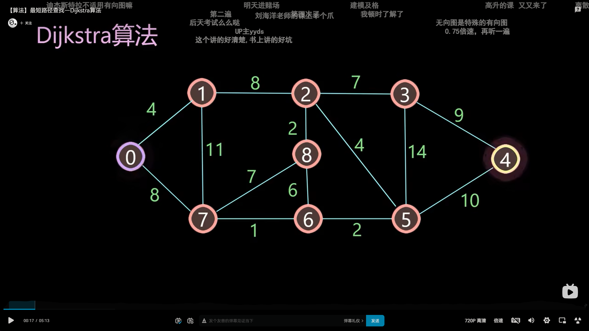
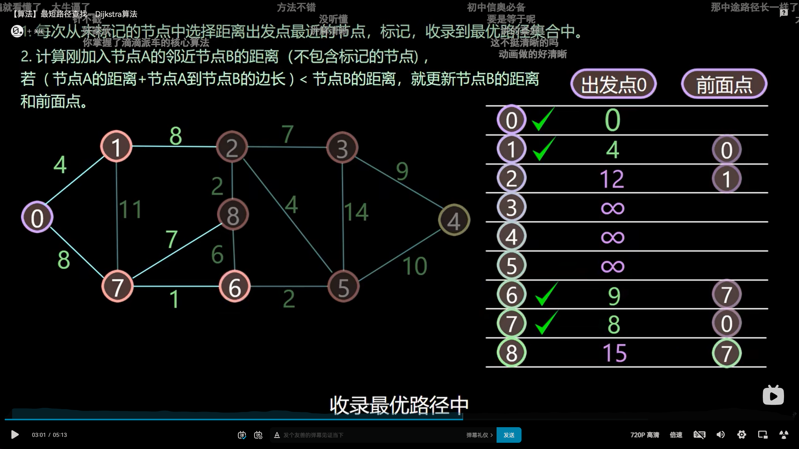
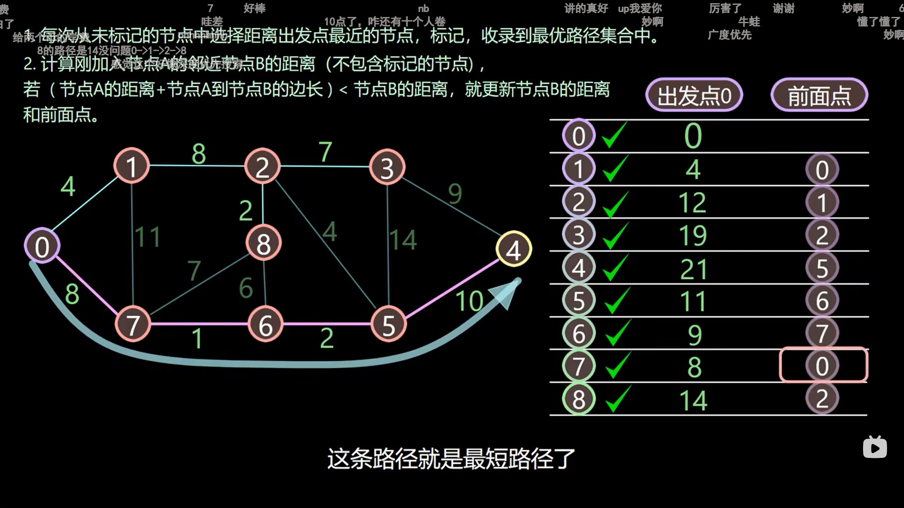
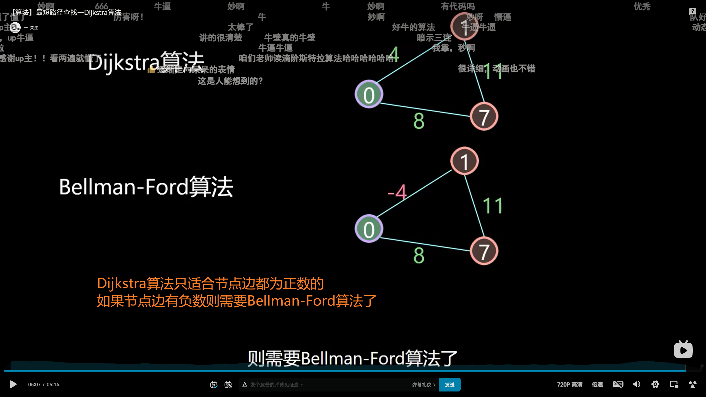
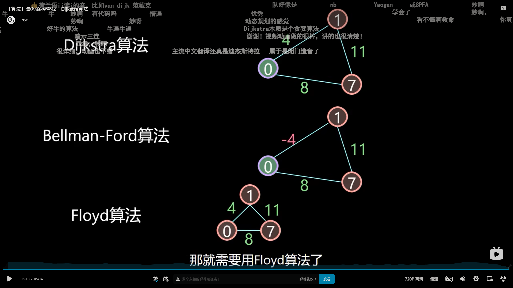
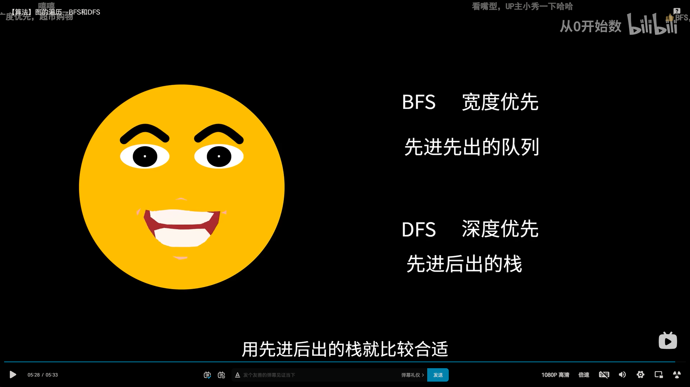

## VS 2022 快捷键

- **Ctrl D**：快速复制当前行到下一行

- **Alt + ↑/↓**：是移动当前行

- **-Ctrl+K+C**：注释

- **Ctrl+K+U**：取消注释

​	

---

[如何在Dev-Cpp中使用C++11中的函数：stoi、to_string、unordered_map、unordered_set、auto](https://www.liuchuo.net/archives/6565)

## 算法常用API：

stoi

to_string *用于 int to string*

unordered_map

unordered_set

auto

[C++中stoi()，atoi() ，to_string()使用技巧](https://developer.aliyun.com/article/789138)

---

​	

vector打印的字符会变成ASCII值

## printVector

```c++
#include <iostream>
#include <vector>
using namespace std;

void printVector(vector<int>& v) {
	for (vector<int>::iterator it = v.begin(); it != v.end(); it++) {
		cout << *it << " ";
	}
	cout << endl;
}

//插入
void test01()
{
	vector<int> v1;
	//尾插
	v1.push_back(10);
	v1.push_back(20);
	v1.push_back(30);
	v1.push_back(40);
	v1.push_back(50);
	v1.push_back('a');
	v1.push_back('I');
	v1.push_back('II');
	printVector(v1);
}

int main() {
	test01(); // 10 20 30 40 50 97 73 18761
	return 0;
}
```

​	

## getline(cin,str)

使用getline(cin,str) 获取单变量的输入字符，范围是一行（即忽视空格），该函数需要引入头文件#include <string>

‘\0’ 在c++中也是NULL的意思，即回车后，获取的字符就是‘\0’ ,也就是‘NULL’ 常用于条件判断

​	

天梯比赛中：一次输入便一次输出是可以的，不是说要等到全部输入完成才进行输出

​	

很巧妙的一个比赛技巧

```c++
for (int i = 0; i < c; i++) {
    cin >> str;
    if (s.find(str) == s.end() && ans.find(str) == ans.end()) {
        ans.insert(str);
        if (flag == 1)
            cout << " ";
        cout << str;
        flag = 1;
    }
}
```

设置flag来控制 " " 达到末尾没有空格的目的

set**不允许**容器中有**重复**的元素

​	

## 存放元素

set主用 `insert()`，vector主用 `push_back()`

​	

## set-find()

`find(key);`  //查找key是否存在,若存在，返回该键的元素的迭代器；若不存在，返回set.end();

> 查找   ---  find    （返回的是迭代器）

​	

## 字符串大小写转换.cpp

```c++
#include <iostream>
using namespace std;

// 转化方法2：利用 toupper() 和 tolower() 函数
void ConversionofLetterTwo()
{
	char ch;
	cin >> ch;

	if (ch >= 'a' && ch <= 'z')
		ch = toupper(ch);
	else if (ch >= 'A' && ch <= 'Z')
		ch = tolower(ch);
	else
	{
		cout << "Invaild Word\n" << endl;
		return;
	}
	cout << ch << endl;
}

int main() {
	ConversionofLetterTwo();
	return 0;
}
```

​	

## 字符串反转

使用 `algorithm` 中的 `reverse` 函数

```c++
#include <iostream>  
#include <string>  
#include <algorithm>  
using namespace std;  
  
int main()  
{  
    string s = "hello";  
  
    reverse(s.begin(),s.end());  
  
    cout<<s<<endl;  
  
    return 0;  
}  
```

vector容器也适用，也是写成 `reverse(s.begin(),s.end()); `

​	

**不定长数组用 vector**

​	

## vector是不定长数组，能用[]访问元素

```c++
// 检测vector能否用[]访问元素
#include <iostream>
#include <vector>
using namespace std;

int main() {
	vector<int> v1; //无参构造
	for (int i = 0; i < 10; i++)
	{
		v1.push_back(i);
	}
	cout << v1[0] << " " << v1[1] << " " << v1[9];
	return 0;
}
```

> 结论：可以，插入进去就是数组，而且是不定长数组，可以通过[]访问数组元素

​	

长度：数组用length()，容器用size()

​	

用临时数组来进行条件判断很好用 不要总想着在目的数组上进行数组改动 可以通过临时数组的改动 最后赋值给目的数组

​	

string库函数，`append()` 用于在字符串后面进行追加字符串操作

​	

## 字符串的替换replace()

```c++
// 字符串替换
#include <iostream>
using namespace std;

void test02()
{
	//替换
	string str1 = "abcdefgde";
	str1.replace(4, 3, "1111");

	cout << "str1 = " << str1 << endl;
}

int main() {
	test02();
	return 0;
}
```

​	

## 【问题】cin getline 混合使用时不能输入 直接执行下一行

经常会遇到一个问题，就是需要混合使用cin>>, cin.getline(), getline()时，有时会碰到不等你输入，就直接运行下一行的情况

```c++
int main() {
    
	int N;
	string c;
	cin >> N;
	cin >> c;

	string s;
	getline(cin, s);

	return 0;
}
```

结果是因为缓冲区还剩一个回车符 直接赋给了getline() 然后就输入执行结束 实际上getline的字符你还没有输入 所以看到这种情况懵了

> 先cin>>，再getline()的情况，是因为cin>>会在缓冲区中多出一个回车符，即你输入完之后，敲完回车符之后，cin>>会在缓冲区中再多保留一个回车符，这个多出来的回车符就导致下面getline()执行时，自动读取缓冲区内的回车符，于是这句getline()就相当于你什么都没有敲就执行完了，自然就会去执行下面的语句了。
>
> 这种情况的解决方法很简单，在cin>>后面加一句cin.get()就行了，这个cin.get()就会将缓冲区内多出来的回车符消耗掉，于是后面的输入就正常了

修改过后的代码

```c++
int main() {

	int N;
	string c;
	cin >> N;
	cin >> c;
	cin.get(); // 用 getchar();也行
	//getchar(); //如果是char c的话
	string s;
	getline(cin, s);

	return 0;
}
```

​	

## sort() - Algorithm

```c++
//方法一：定义比较函数（最常用）
//情况一：数组排列
int A[100];
bool cmp1(int a,int b)//int为数组数据类型
{
return a>b;//降序排列
//return a<b;//默认的升序排列
}
sort(A,A+100,cmp1);

// 参考文章：https://www.cnblogs.com/stones-dream/p/10183210.html
```

​	

## 常犯的一个错误：段错误

经常原因：for循环从最大长度到0 经常只改了第一条件，第三条件 i++总是忘记改成 i--

​	

算法：模拟除法

​	

## memset()

> C 库函数 **void \*memset(void \*str, int c, size_t n)** 复制字符 **c**（一个无符号字符）到参数 **str** 所指向的字符串的前 **n** 个字符

https://www.runoob.com/cprogramming/c-function-memset.html

​	

## isalnum

`isalnum()` 用来判断一个字符是否为数字或者字母，也就是说判断一个字符是否属于a~z||A~Z||0~9

```c++
cout << isalnum('a');//输出非零
cout << isalnum('2');//非零
cout << isalnum('.');//零
```

​	

## front()与back()

```c++
string a="abcd";

1.获取字符串最后一个字符
auto b=a.back(); //结果为 b='d';

2.修改字符串最后一个字符
a.back()='!'; //结果为 a="abc!";

3.获取字符串第一个字符
auto b=a.front(); //结果为 b='a';

4.修改字符串第一个字符
a.front()='!'; //结果为 a="!bcd";

```

​	

## begin()和end()

c.begin();      返回指向容器最开始位置数据的指针

c.end();       返回指向容器最后一个数据单元+1的指针

如果我们要输出最后一个元素的值应该是 ***（--c.end()）**;

​	

> 运行超时相关的算法题，不要用字符串[]形式去检索做条件判断，运行时间太长了，用出发先计算得出/ 或者<< 左右移计算得出

例题：[回文日期](https://www.lanqiao.cn/problems/498/learning/?page=1&first_category_id=1&sort=students_count&second_category_id=3)

​	

> string.substr(a,n),第一个参数是下标位置，第二个参数的数量n，而不是结束的下标位置

​	

数组如果每次循环都要重新初始化为初值，建议直接写在循环里，方便遍历每一次，不然自己还要设置初值有时比较棘手，但也可能出现这样我服了【哭泣】


​	

## dfs、贪心、动态规划、快速排序思想和归并排序 学习一下

​	

桶排序往往和取余运算相结合

exit(0); //相当于主程序main直接return 0了 这个可以学习一下，在多重循环里可以运用

​	

[C++四舍五入保留二位小数](https://blog.csdn.net/PanDaoxi2020/article/details/118967982)

```c++
// 方法一：
#include <iostream>
#include <iomanip>
using namespace std;
int main(){
	double x;
	cin>>x;
	cout<<fixed<<setprecision(2)<<x<<endl;
	return 0;
} 

```

```c++
// 方法二：
#include <cstdio>
using namespace std;

int main(){
	double x;
	scanf("%lf",&x);
	printf("%.2lf",x);
    
    //test 例子：
	double n = 12.12599;
	printf("%.2lf", n); //除；1会保留两位小数，还会四舍五入
	return 0;
}

```

​	

## Dijkstra算法







Dijkstra算法是从一个顶点到其余各顶点的最短路径算法



Dijkstra算法只适合节点边都为正数的，如果节点边有负数则需要Bellman-Ford算法了

如果需要求任意两点之间的最短路径，则需要用Floyd算法



​	

## DFS和BFS



​	

## c++万能头文件

#include <bits/stdc++.h>
